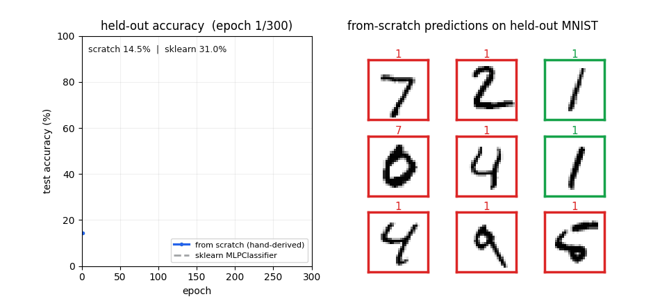

# ml-from-scratch

My implementations of different machine learning algorithms from scratch.

**Work in progress**

## demo

The dense network trained with my own hand-derived matrix backprop on real MNIST (28x28), raced against scikit-learn's `MLPClassifier` with the same 784→100→10 architecture. Same data, same width. The from-scratch gradients climb the same curve and end up neck-and-neck (94.5% vs 94.0% on held-out, ~3s training).



```bash
cd dense && python3 demo.py   # regenerates demo.gif
```

## motivation

Prior to building these models, I had explored many machine learning model implementations from different ML libraries like pytorch, scikit-learn, tensorflow (Fully Connected Lyears, convoluitonal neural networks, and recurrent neural networks)

However, while I have understood the forward propogation of these model archetypes, the backpropogation and training phase has been a black box for me. Thus, I wanted to work on a project where I could get my hands dirty and actually implement everything for a machine laerning model.

Also motivated by my friend who was training a model using a loop implementation of backpropogation on the mnist dataset (I wanted to beat his accuracy score)

## implementations

### dense

#### evolutionary algorithm

a very basic training algorithm
the most intuitive one to me
how it works (my version)

-   generate random changes to make to the model
-   pick which one is the best (based on evaluating the loss function on the model if the change was applyed)
-   apply it
-   repeat
    alternate version
-   generate a list of models (only at start)
-   mutate them
    -   for each, make copies and add random changes to each copy and add them to the list
-   remove the worst n models (by loss function)
-   repeat
    my implementation
-   class: EvolutionaryModel
    -   int (inherited): num_parameter_groups
    -   function: get_all_parameters
    -   function: get_all_shapes
-   function: generate_mutation
    -   uses get_all_shapes to generate mutations in the shapes of the parameters
-   function: apply_mutation
    -   just adds the mutations to the model
-   function: train
    -   uses generate_mutation and apply_mutation to find the best mutations

#### matrix backpropogation

helpful video: <https://www.youtube.com/watch?v=URJ9pP1aURo>

this was much harder than the evolutionary algorithm
basically use chain rule but now for matrices
the fact that we are working with matrices makes things like division and dimension annoying
key intuition: after applying chain rule, literally move random matrices around so that dimensions work out

ex:
**model**
X1 = M1 @ X + B1 (X: input)
X2 = tanh(X1)  
l = (X2 - Y)^2 (l: loss, Y: target)

let f(x) = derivative of activation function
**backprop**
dl/dB1 = sum(2 _ (X2 - Y) _ f(X1), axis = 1) (row sum)
dl/dW1 = 2 _ (X2 - Y) _ f(X1) \* X

implementation

-   class: Model
    -   list: layers
    -   list: gradient_functions
        -   have the same length as layers, put a function for each trainable layer
    -   function: step
        -   do a forward, then get the intermidiate values, and update the layers with the gradient functions times the learning rate

## todo

-   visulaize weights of DNN for mnist
-   automatic backprop for DNN (currently you have to input the gradient function manually)
-   backpropogation of a CNN layer
-   backpropogation of a RNN layer
